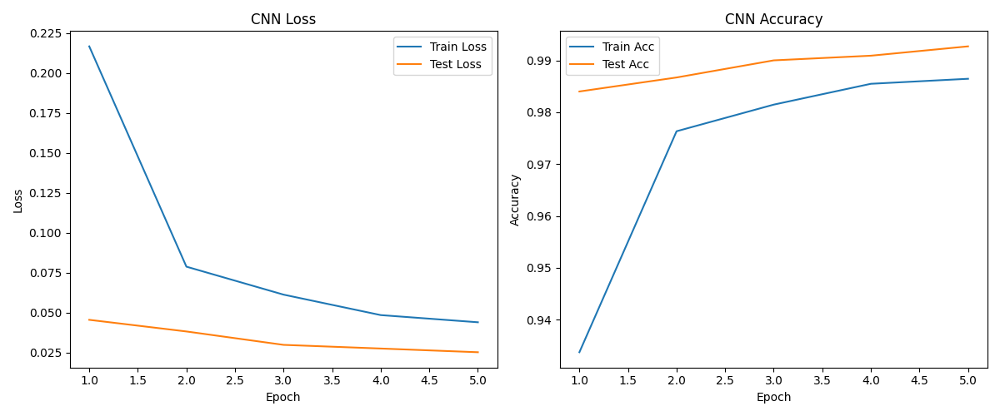
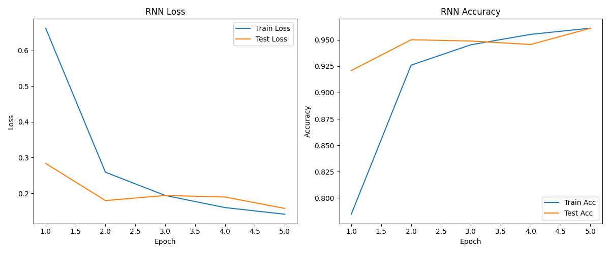
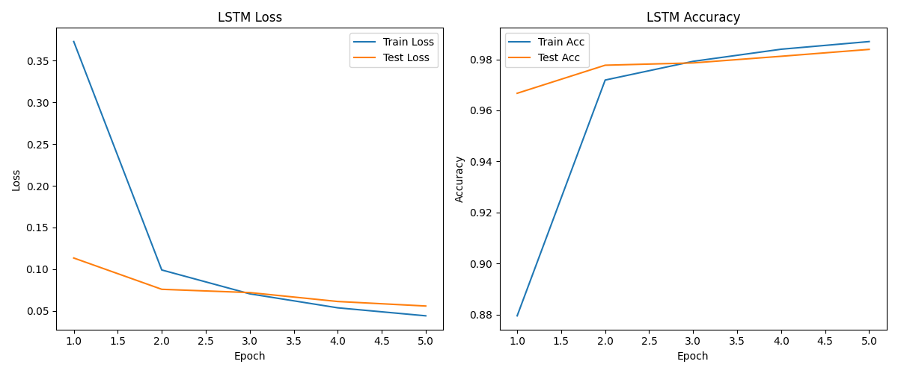
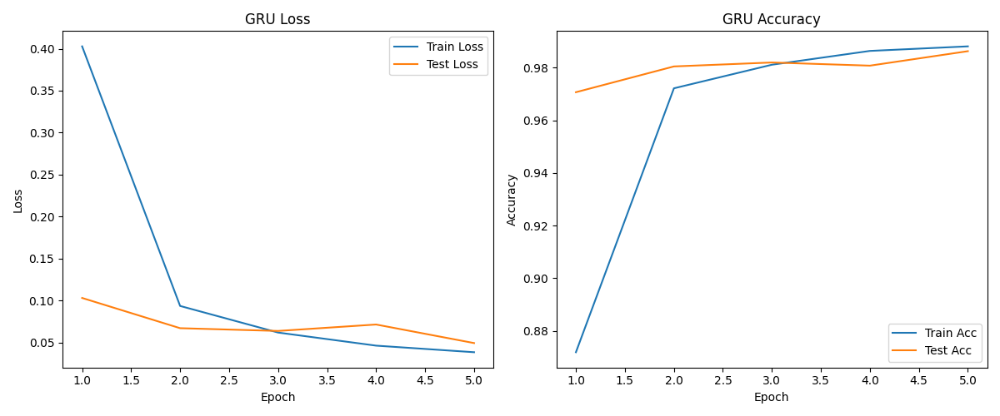
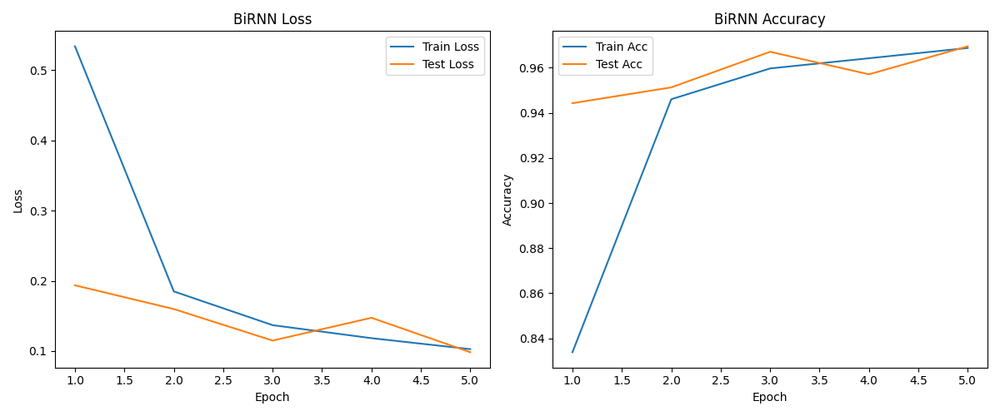
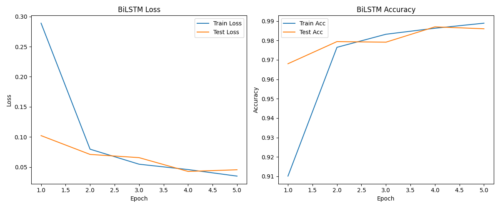
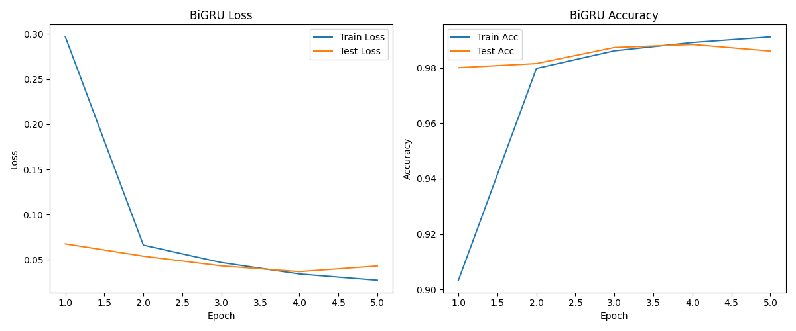

# 🧠 Deep Learning: CNN vs RNN for MNIST Image Classification

This project compares **Convolutional Neural Networks (CNN)** and several **Recurrent Neural Network (RNN)** architectures — including **LSTM**, **GRU**, and their bidirectional variants — on the **MNIST** handwritten digit dataset.  
The goal is to analyze how spatial (CNN) and sequential (RNN family) models handle 2D image data.

---

## 📁 Project Overview

**Notebook:** [`CNNvsRNN-MNIST.ipynb`](./CNNvsRNN_MNIST.ipynb)

**Dataset:** [MNIST Handwritten Digits](https://www.kaggle.com/datasets/hojjatk/mnist-dataset)

**Framework:** PyTorch

---

## ⚙️ 1. Project Stages

### **1️⃣ Data Preparation**
- MNIST images (28×28 grayscale) are normalized using the dataset mean and standard deviation:  
  ```python
  transforms.Normalize((0.1307,), (0.3081,))
  ```
- Train/test splits and DataLoaders created for efficient batching.

### **2️⃣ Model Architectures**
Implemented models:
- `CNN`: Two convolutional layers + dropout + fully connected head  
- `RNN`: Vanilla RNN treating each image row (28 pixels) as a time step  
- `LSTM`: Long Short-Term Memory network to capture longer dependencies  
- `GRU`: Gated Recurrent Unit for computational efficiency  
- `BiRNN`, `BiLSTM`, `BiGRU`: Bidirectional variants aggregating forward and backward sequence information  

Each model ends with a fully connected layer + `log_softmax` output.

### **3️⃣ Training Setup**
```python
batch_size = 64
learning_rate = 0.001
num_epochs = 5
optimizer = Adam
criterion = CrossEntropyLoss
device = "cuda" if available else "cpu"
```

### **4️⃣ Evaluation Metrics**
- **Accuracy** and **Loss** on the train and test set  
- **Training Time** (in **minutes:seconds**, MM:SS) measured for performance comparison

---

## 📊 2. Results

| Model  | Accuracy | Loss   | Time  |
|:--------|:--------:|:------:|:------:|
| **CNN**   | **0.9927** | 0.0253 | 08:46 |
| RNN   | 0.9610 | 0.1577 | 02:48 |
| LSTM  | 0.9839 | 0.0558 | 04:53 |
| GRU   | 0.9863 | 0.0492 | 04:31 |
| BiRNN | 0.9671 | 0.1149 | 04:08 |
| BiLSTM| 0.9870 | 0.0429 | 09:27 |
| BiGRU | 0.9885 | **0.0369** | 07:46 |


---

## 📈 3. Visualization

Each model’s training and validation performance is plotted using the provided `plot_history()` function.

```python
plot_history(history, model_name="CNN")
```

Example output:

- **Left:** Loss over epochs  
- **Right:** Accuracy over epochs  
- Automatically saved as `<model_name>_training_plot.png`

---
### 3.1 Visualization of CNN

<p align="center">
  
</p>

**Observation:**  
- CNN achieves stable convergence and highest accuracy among all models.  
- Both training and validation curves closely follow each other, showing minimal overfitting.  

---

### 3.2 Visualization of RNN

<p align="center">
  
</p>

**Observation:**  
- Training converges faster but accuracy saturates early.  
- RNN struggles with spatial dependencies, leading to lower overall performance.  

---

### 3.3 Visualization of LSTM

<p align="center">
  
</p>

**Observation:**  
- LSTM improves over vanilla RNN with smoother convergence.  
- Validation accuracy nearly matches CNN performance, showing stronger sequence modeling.  

---

### 3.4 Visualization of GRU

<p align="center">
  
</p>

**Observation:**  
- GRU achieves similar accuracy to LSTM with faster training time.  
- Training is stable, and generalization is slightly better than LSTM.  

---

### 3.5 Visualization of BiRNN

<p align="center">
  
</p>

**Observation:**  
- Bidirectionality slightly improves test accuracy but doubles the computational cost.  
- Overfitting appears at later epochs.  

---

### 3.6 Visualization of BiLSTM

<p align="center">
  
</p>

**Observation:**  
- BiLSTM achieves strong results comparable to GRU and CNN.  
- Both directions capture complementary sequence information, enhancing recognition accuracy.  

---

### 3.7 Visualization of BiGRU

<p align="center">
  
</p>

**Observation:**  
- BiGRU shows excellent stability and efficiency, ranking second after CNN.  
- It combines fast training with strong bidirectional context learning.  

## 💬 4. Discussion

### **CNN:**
- Achieved the **highest accuracy (99.27%)** and **lowest loss** among all models.  
- CNNs are naturally suited for image data due to their ability to learn spatial hierarchies through convolution and pooling layers.  
- However, training time is relatively longer due to convolutional operations.

### **RNN and Bidirectional RNN:**
- Performed **significantly worse** (96.1–96.7%) because vanilla RNNs struggle with long-range dependencies and are not ideal for 2D spatial patterns.
- Bidirectional RNN improved slightly but at a cost in training time.

### **LSTM and GRU Families:**
- **LSTM** and **GRU** achieved strong results (~98.6–98.9%) — better than simple RNNs but below CNN.
- **BiLSTM** and **BiGRU** further improved performance by processing sequences in both directions.
- **BiGRU** reached a good balance between accuracy and efficiency, with slightly faster training than BiLSTM.

---

## 🚀 5. Conclusions & Possible Improvements

| Observation | Suggestion |
|--------------|-------------|
| CNN dominates for spatial pattern recognition | Try deeper CNNs (e.g., ResNet, LeNet5+) |
| RNN-family models show potential but are less efficient | Replace with **ConvLSTM** or **Vision Transformers (ViT)** |
| Training time varies greatly | Use **mixed precision** and **smaller hidden sizes** to speed up |
| All models use default hyperparameters | Perform **hyperparameter tuning** (e.g., Optuna, RayTune) |

---

## 🧩 6. Repository Structure

```
├── CNNvsRNN-MNIST.ipynb      # Main notebook
├── Results.png                # Performance comparison table
├── saved_models/              # Trained weights
├── README.md                  # Project documentation
└── requirements.txt           # Dependencies
```

---

## 📚 References

- LeCun, Y., Bottou, L., Bengio, Y., & Haffner, P. (1998). *Gradient-based learning applied to document recognition.*
- Hochreiter, S., & Schmidhuber, J. (1997). *Long short-term memory.*
- Cho, K. et al. (2014). *Learning phrase representations using RNN encoder–decoder for statistical machine translation.*
